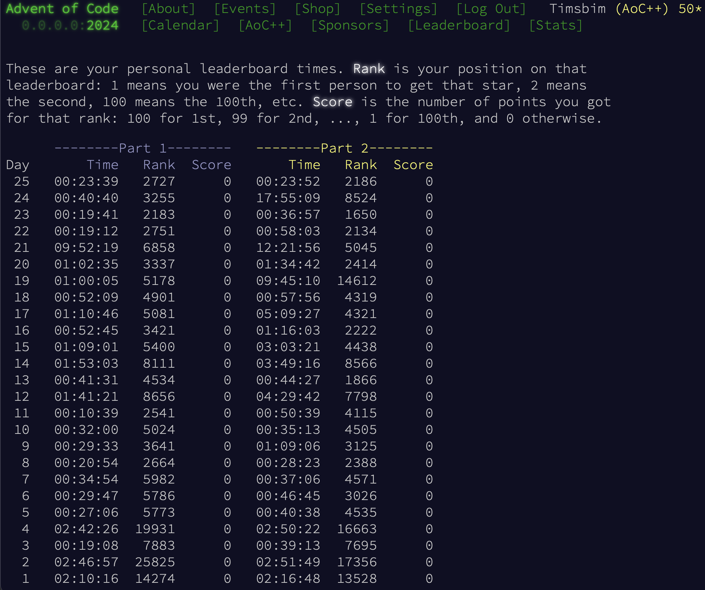

# Solutions to the [Advent of Code 2024][AoC] mysteries.

All solutions are from me, without any help. There's no shame in getting help - but I like the challenge. The initial solutions are usually messy and take longer to run, the ones here are refactored and optimized. I'm running the code mostly in [PyPy][PyPy] to speed it up a little bit.

As [requested][AoC_About] by [Eric Wastl][Eric], the creator of Advent of Code, the repository doesn't contain any inputs.

My statistics (I'll never make it on the leaderboard 😀):

 [AoC]:https://adventofcode.com/2024
 [AoC_About]:https://adventofcode.com/2024/about
 [Eric]:https://was.tl
 [PyPy]:https://pypy.org
